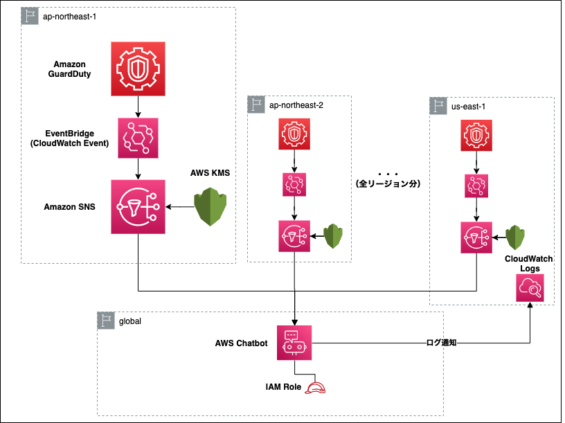

# tf-guardduty

Terraform sample code to enable GuardDuty and notify GuardDuty findings for all regions

## Structure



## Directories

```
.
├── hgsgtk-dev
└── modules
    ├── chatbot <- module for AWS Chatbot
    └── guardduty <- module for Guard Duty
```

## Getting Started

- install `tfenv` to switch terraform version.

```
tfenv install 0.13.5
tfenv use 0.13.5
```

- initialize

```
terraform init
```

- setup remote backend

Create an S3 bucket to store the tfstate

## Apply

```
terraform apply -var="aws_account_id=<your-account>"
```

## ToDo

- AWS Chatbot is not included in this code because it is not terraform compliant.

See also https://github.com/hashicorp/terraform-provider-aws/issues/12304
